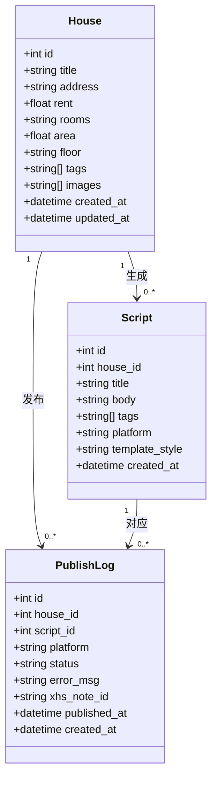
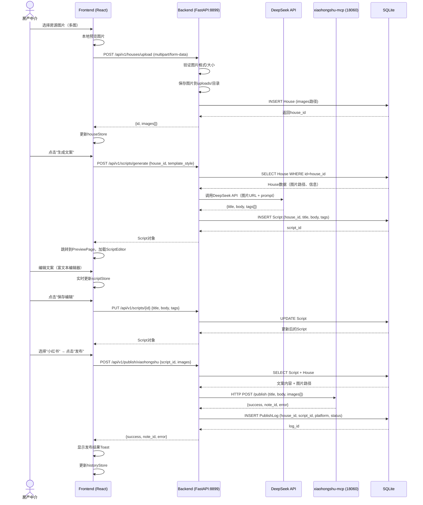
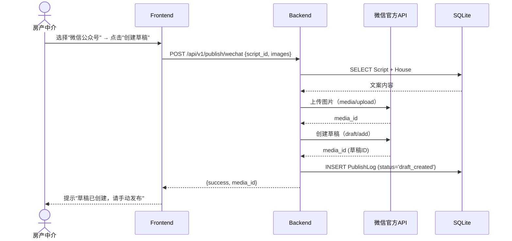
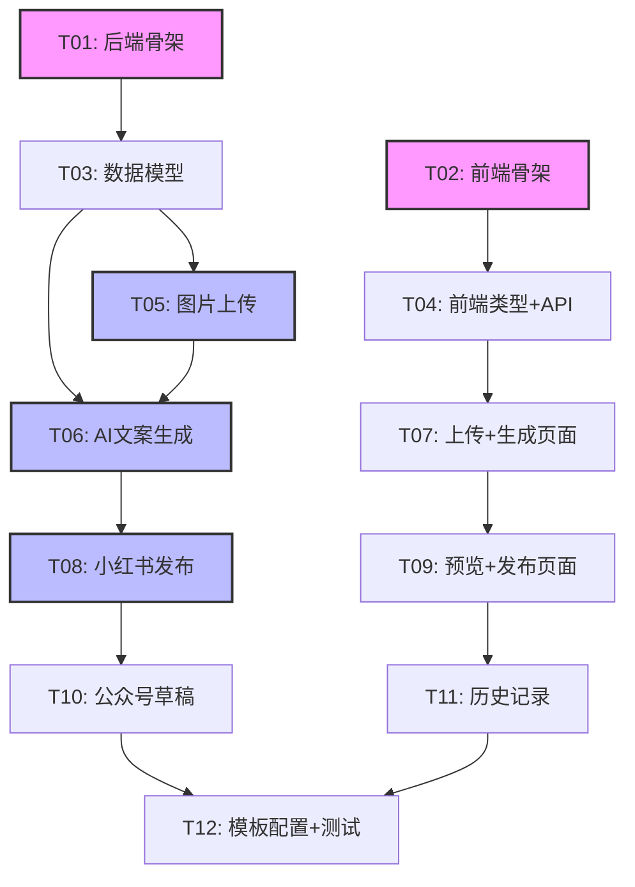

# 房屋租赁AI营销系统 - 系统架构设计

> 版本：V1.0  
> 日期：2026-07-05  
> 架构师：高见远（Gao）

---

## 1. 实现方案 + 框架选型

### 1.1 技术栈确认

| 层级 | 框架/工具 | 版本 | 选型理由 |
|------|-----------|------|----------|
| **后端** | FastAPI | ^0.115.0 | 异步支持好、自动生成OpenAPI文档、Python生态丰富 |
| **后端** | SQLAlchemy (async) | ^2.0.0 | 成熟ORM、支持异步、迁移方便 |
| **后端** | Pydantic v2 | ^2.0.0 | 数据验证、与FastAPI深度集成 |
| **后端** | DeepSeek API | OpenAI兼容 | 成本较低、中文文案生成质量好 |
| **后端** | xiaohongshu-mcp | HTTP API | 小红书发布集成（已有MCP服务） |
| **前端** | Vite | ^6.0.0 | 构建速度快、开发体验好 |
| **前端** | React | ^19.0.0 | 组件化、生态成熟 |
| **前端** | Vant UI | ^4.0.0 | 移动端优先、React版本可用 |
| **前端** | Tailwind CSS | ^4.0.0 | 快速样式开发、可定制性强 |
| **数据库** | SQLite | 3.x | V1轻量级、无需独立服务、文件级部署 |
| **AI** | DeepSeek Chat | deepseek-chat | 性价比高、支持JSON输出格式 |

### 1.2 核心挑战与解决方案

| 挑战 | 解决方案 |
|------|----------|
| 图片上传与存储 | 前端直传后端，后端存本地临时目录，SQLite记录路径，7天后清理 |
| AI文案生成 | 调用DeepSeek API，使用多模态模型分析图片+用户补充信息，输出结构化JSON |
| 小红书发布 | 通过xiaohongshu-mcp HTTP API（localhost:18060）发布，V1手动登录一次 |
| 微信公众号 | V1只创建草稿，不自动发布（避免认证依赖） |
| 文案编辑 | 使用富文本编辑器（TipTap或Slate），支持实时预览 |

### 1.3 架构模式

- **后端**：分层架构（Routes → Services → Models）
- **前端**：组件化 + 状态管理（Zustand）
- **通信**：RESTful API + JSON

---

## 2. 文件列表及相对路径

```
house-ai/
├── README.md                          # 项目说明
├── .env.example                       # 环境变量模板
├── ARCHITECTURE.md                   # 本文件
├── PRD.md                            # 产品需求文档
│
├── backend/                          # 后端服务（端口8899）
│   ├── main.py                       # FastAPI应用入口、CORS配置、路由注册
│   ├── config.py                     # pydantic-settings环境变量加载
│   ├── database.py                   # SQLAlchemy async引擎、SessionLocal、Base
│   ├── models.py                     # SQLAlchemy ORM模型（House, Script, PublishLog）
│   ├── schemas.py                    # Pydantic请求/响应Schema
│   ├── requirements.txt              # Python依赖清单
│   ├── alembic.ini                   # (可选)数据库迁移配置
│   │
│   ├── routes/                       # API路由层
│   │   ├── __init__.py
│   │   ├── house.py                 # 房源相关路由（上传、列表、删除）
│   │   ├── script.py                # 文案相关路由（生成、预览、更新）
│   │   ├── publish.py               # 发布相关路由（小红书、公众号）
│   │   └── history.py              # 历史记录路由
│   │
│   ├── services/                     # 业务逻辑层
│   │   ├── __init__.py
│   │   ├── house_service.py         # 房源业务逻辑（CRUD、图片处理）
│   │   ├── ai_service.py           # AI文案生成（DeepSeek API调用）
│   │   ├── xhs_service.py          # 小红书发布集成（xiaohongshu-mcp）
│   │   ├── wechat_service.py       # 微信公众号草稿创建
│   │   └── storage_service.py      # 临时文件存储与清理
│   │
│   ├── uploads/                      # 临时图片存储（7天清理）
│   │   └── .gitkeep
│   └── logs/                        # 日志目录
│       └── .gitkeep
│
└── frontend/                         # 前端应用（端口3000）
    ├── index.html                    # HTML入口
    ├── package.json                  # Node.js依赖清单
    ├── tsconfig.json                 # TypeScript配置
    ├── tsconfig.node.json            # Node环境TS配置
    ├── vite.config.ts               # Vite构建配置（代理、端口）
    ├── tailwind.config.ts           # Tailwind CSS配置
    ├── postcss.config.js            # PostCSS配置
    ├── .env.development             # 开发环境变量（VITE_API_BASE_URL）
    │
    ├── src/
    │   ├── main.tsx                 # React应用入口
    │   ├── App.tsx                  # 根组件、路由配置
    │   ├── index.css                # 全局样式（Tailwind指令）
    │   │
    │   ├── pages/                   # 页面组件
    │   │   ├── UploadPage.tsx      # 图片上传页
    │   │   ├── GeneratePage.tsx    # 文案生成页（含编辑）
    │   │   ├── PreviewPage.tsx     # 文案预览页
    │   │   ├── PublishPage.tsx     # 发布选择页
    │   │   └── HistoryPage.tsx     # 历史记录页
    │   │
    │   ├── components/              # 可复用组件
    │   │   ├── ImageUploader.tsx   # 图片上传组件（多图、预览、删除）
    │   │   ├── ScriptEditor.tsx    # 富文本编辑器组件
    │   │   ├── PlatformSelector.tsx # 平台选择组件（小红书/公众号）
    │   │   ├── PublishButton.tsx   # 发布按钮组件（含状态反馈）
    │   │   └── HistoryCard.tsx     # 历史记录卡片组件
    │   │
    │   ├── services/                # API调用层
    │   │   ├── api.ts              # axios实例、拦截器
    │   │   ├── houseApi.ts         # 房源相关API
    │   │   ├── scriptApi.ts        # 文案相关API
    │   │   └── publishApi.ts       # 发布相关API
    │   │
    │   ├── stores/                  # 状态管理（Zustand）
    │   │   ├── houseStore.ts       # 房源状态（当前房源、图片列表）
    │   │   ├── scriptStore.ts      # 文案状态（生成结果、编辑内容）
    │   │   └── uiStore.ts          # UI状态（loading、toast）
    │   │
    │   ├── types/                   # TypeScript类型定义
    │   │   ├── house.ts           # 房源相关类型
    │   │   ├── script.ts          # 文案相关类型
    │   │   └── api.ts             # API响应通用类型
    │   │
    │   └── utils/                   # 工具函数
    │       ├── format.ts           # 日期格式化、文件大小格式化
    │       └── constants.ts       # 常量（平台列表、模板风格）
    │
    └── dist/                        # 构建产物（gitignore）
```

---

## 3. 数据结构和接口

### 3.1 类图（Mermaid）



### 3.2 API接口清单

#### 房源相关（`/api/v1/houses`）

| 方法 | 路径 | 说明 | 请求体 | 响应 |
|------|------|------|--------|------|
| POST | `/api/v1/houses/upload` | 上传房源图片 | `multipart/form-data` (images[], house_info?) | `{id, images[]}` |
| GET | `/api/v1/houses` | 获取房源列表 | - | `{items: House[]}` |
| GET | `/api/v1/houses/{id}` | 获取房源详情 | - | `House` |
| DELETE | `/api/v1/houses/{id}` | 删除房源 | - | `{message}` |

#### 文案相关（`/api/v1/scripts`）

| 方法 | 路径 | 说明 | 请求体 | 响应 |
|------|------|------|--------|------|
| POST | `/api/v1/scripts/generate` | AI生成文案 | `{house_id, template_style}` | `Script` |
| GET | `/api/v1/scripts/{id}` | 获取文案详情 | - | `Script` |
| PUT | `/api/v1/scripts/{id}` | 更新文案（编辑后） | `{title, body, tags[]}` | `Script` |
| GET | `/api/v1/scripts` | 获取文案列表 | `?house_id=` | `{items: Script[]}` |

#### 发布相关（`/api/v1/publish`）

| 方法 | 路径 | 说明 | 请求体 | 响应 |
|------|------|------|--------|------|
| POST | `/api/v1/publish/xiaohongshu` | 发布到小红书 | `{script_id, images[]}` | `{success, note_id, error}` |
| POST | `/api/v1/publish/wechat` | 创建公众号草稿 | `{script_id, images[]}` | `{success, media_id, error}` |
| GET | `/api/v1/publish/logs` | 获取发布记录 | `?house_id=` | `{items: PublishLog[]}` |

#### 历史记录（`/api/v1/history`）

| 方法 | 路径 | 说明 | 请求体 | 响应 |
|------|------|------|--------|------|
| GET | `/api/v1/history` | 获取历史记录 | `?skip=0&limit=20` | `{items: HistoryItem[]}` |
| DELETE | `/api/v1/history/{id}` | 删除历史记录 | - | `{message}` |

### 3.3 Pydantic Schemas（后端）

```python
# schemas.py 核心定义

class HouseCreate(BaseModel):
    title: str | None = None
    address: str | None = None
    rent: float | None = None
    rooms: str | None = None
    area: float | None = None
    floor: str | None = None
    tags: list[str] = []

class HouseResponse(BaseModel):
    id: int
    title: str | None
    address: str | None
    rent: float | None
    rooms: str | None
    area: float | None
    floor: str | None
    tags: list[str]
    images: list[str]
    created_at: datetime
    class Config:
        from_attributes = True

class ScriptGenerateRequest(BaseModel):
    house_id: int
    template_style: Literal["professional", "friendly", "urgent"] = "professional"

class ScriptResponse(BaseModel):
    id: int
    house_id: int
    title: str
    body: str
    tags: list[str]
    platform: str | None
    template_style: str | None
    created_at: datetime
    class Config:
        from_attributes = True

class PublishRequest(BaseModel):
    script_id: int
    images: list[str]  # 图片路径列表

class PublishResponse(BaseModel):
    success: bool
    platform: str
    note_id: str | None = None
    media_id: str | None = None
    error: str | None = None
```

---

## 4. 程序调用流程（Mermaid时序图）

### 4.1 核心链路：上传图片 → AI生成文案 → 预览编辑 → 发布



### 4.2 微信公众号草稿创建流程（V1简化版）



---

## 5. 任务列表（有序、含依赖关系）

### 任务分组说明

按依赖关系和实现顺序分为5个阶段，每个阶段包含多个相关文件。

| 阶段 | 任务ID | 任务名称 | 涉及文件 | 依赖 | 优先级 |
|------|--------|----------|----------|------|--------|
| **阶段1：基础设施** | T01 | 后端项目骨架搭建 | `backend/main.py`, `backend/config.py`, `backend/database.py`, `backend/requirements.txt` | 无 | P0 |
| **阶段1：基础设施** | T02 | 前端项目骨架搭建 | `frontend/package.json`, `frontend/vite.config.ts`, `frontend/src/main.tsx`, `frontend/src/App.tsx` | 无 | P0 |
| **阶段2：数据层** | T03 | 数据库模型 + Schema定义 | `backend/models.py`, `backend/schemas.py` | T01 | P0 |
| **阶段2：数据层** | T04 | 前端类型定义 + API服务 | `frontend/src/types/*`, `frontend/src/services/api.ts` | T02 | P0 |
| **阶段3：核心功能** | T05 | 图片上传接口 + 服务 | `backend/routes/house.py`, `backend/services/house_service.py`, `backend/services/storage_service.py` | T03 | P0 |
| **阶段3：核心功能** | T06 | AI文案生成接口 + 服务 | `backend/routes/script.py`, `backend/services/ai_service.py` | T03, T05 | P0 |
| **阶段3：核心功能** | T07 | 前端上传页面 + 生成页面 | `frontend/src/pages/UploadPage.tsx`, `frontend/src/pages/GeneratePage.tsx`, `frontend/src/components/ImageUploader.tsx` | T04 | P0 |
| **阶段4：发布集成** | T08 | 小红书发布集成 | `backend/routes/publish.py`, `backend/services/xhs_service.py` | T06 | P0 |
| **阶段4：发布集成** | T09 | 前端预览 + 发布页面 | `frontend/src/pages/PreviewPage.tsx`, `frontend/src/pages/PublishPage.tsx`, `frontend/src/components/ScriptEditor.tsx` | T07 | P0 |
| **阶段5：完善功能** | T10 | 微信公众号草稿创建 | `backend/services/wechat_service.py`, `frontend/src/components/PlatformSelector.tsx` | T08 | P1 |
| **阶段5：完善功能** | T11 | 历史记录管理 | `backend/routes/history.py`, `frontend/src/pages/HistoryPage.tsx`, `frontend/src/stores/houseStore.ts` | T06 | P1 |
| **阶段5：完善功能** | T12 | 文案模板配置 + 集成测试 | `frontend/src/utils/constants.ts`, 测试用例 | T09, T10 | P1 |

### 任务依赖图（Mermaid）



---

## 6. 依赖包列表

### 6.1 backend/requirements.txt

```txt
# FastAPI核心
fastapi==0.115.0
uvicorn[standard]==0.32.0
pydantic==2.9.0
pydantic-settings==2.6.0

# 数据库
sqlalchemy[asyncio]==2.0.36
aiosqlite==0.20.0

# AI集成
openai==1.54.0  # DeepSeek使用OpenAI兼容格式

# 文件处理
python-multipart==0.0.12  # 文件上传
Pillow==11.0.0            # 图片处理（可选）

# HTTP客户端（调用xiaohongshu-mcp）
httpx==0.27.2

# 环境变量
python-dotenv==1.0.0

# 日志
loguru==0.7.3

# 日期时间
pydantic[datetime]==2.9.0
```

### 6.2 frontend/package.json

```json
{
  "name": "house-ai-frontend",
  "private": true,
  "version": "1.0.0",
  "type": "module",
  "scripts": {
    "dev": "vite",
    "build": "tsc -b && vite build",
    "preview": "vite preview"
  },
  "dependencies": {
    "react": "^19.0.0",
    "react-dom": "^19.0.0",
    "react-router-dom": "^6.28.0",
    "zustand": "^5.0.0",
    "axios": "^1.7.7",
    "@vant/ui": "^4.0.0",
    "tailwindcss": "^4.0.0",
    "lucide-react": "^0.454.0",
    "@tiptap/react": "^2.10.0",
    "@tiptap/starter-kit": "^2.10.0"
  },
  "devDependencies": {
    "@types/react": "^19.0.0",
    "@types/react-dom": "^19.0.0",
    "@vitejs/plugin-react": "^4.3.0",
    "typescript": "^5.6.0",
    "vite": "^6.0.0",
    "postcss": "^8.4.0",
    "autoprefixer": "^10.4.0"
  }
}
```

---

## 7. 共享知识（跨文件约定）

### 7.1 端口与路径

| 项目 | 端口 | 说明 |
|------|------|------|
| 后端FastAPI | **8899** | 统一，不用8000 |
| 前端Vite | **3000** | 统一 |
| xiaohongshu-mcp | **18060** | 已有服务，HTTP API |

- API路径前缀：`/api/v1/`（全平台统一）
- 前端开发代理：`/api/v1` → `http://localhost:8899/api/v1`

### 7.2 CORS配置

```python
# backend/main.py
app.add_middleware(
    CORSMiddleware,
    allow_origins=["http://localhost:3000"],
    allow_credentials=True,
    allow_methods=["*"],
    allow_headers=["*"],
)
```

### 7.3 环境变量命名规范

- 全部大写 + 下划线分隔
- 示例：
  - `DEEPSEEK_API_KEY`
  - `DEEPSEEK_BASE_URL`
  - `XHS_MCP_URL`
  - `WECHAT_APPID`
  - `WECHAT_APPSECRET`
  - `UPLOAD_DIR`
  - `IMAGE_RETENTION_DAYS`

### 7.4 错误响应格式统一

```json
// 成功响应
{
  "data": {...},
  "message": "success"
}

// 错误响应（HTTP 4xx/5xx）
{
  "detail": "错误信息描述"
}
```

### 7.5 图片存储约定

- 存储路径：`backend/uploads/{house_id}/{timestamp}_{filename}`
- 数据库存相对路径：`/uploads/{house_id}/{filename}`
- 前端访问URL：`http://localhost:8899/uploads/{house_id}/{filename}`
- 清理策略：每天凌晨清理超过7天的文件

### 7.6 AI提示词模板

```
你是一位专业的房产营销文案撰写者。请根据以下房源信息生成营销文案：

房源信息：
- 标题：{title}
- 地址：{address}
- 租金：{rent}元/月
- 户型：{rooms}
- 面积：{area}平米
- 楼层：{floor}
- 标签：{tags}

风格要求：{template_style}

请输出JSON格式：
{
  "title": "吸引人的标题（20字以内）",
  "body": "详细文案（300-500字，包含emoji）",
  "tags": ["标签1", "标签2", "标签3"]
}
```

---

## 8. 待明确事项

来自PRD的5个待确认问题，V1决策如下：

| # | 问题 | V1决策 | 后续版本 |
|---|------|--------|----------|
| 1 | 小红书登录态管理 | **V1决定**：用户手动在MCP环境登录一次，后端调用时复用cookie | V1.1：支持cookie自动刷新 |
| 2 | 微信公众号发布权限 | **V1决定**：只创建草稿，不自动发布（避免服务号认证依赖） | V1.1：支持认证后自动发布 |
| 3 | AI计费策略 | **V1决定**：不限制次数，由用户自己的API key控制 | V1.1：增加配额管理 |
| 4 | 图片存储方案 | **V1决定**：临时存储（生成文案后保留7天），用SQLite存文件路径 | V1.1：考虑对象存储（OSS/COS） |
| 5 | 发布失败处理 | **V1决定**：记录失败日志，前端提示用户手动重试 | V1.1：支持失败自动重试队列 |

### 8.1 额外待明确事项

1. **DeepSeek API的视觉理解能力**：需要确认`deepseek-chat`模型是否支持图片输入，若不支持需要换用其他多模态模型（如GPT-4V、Claude 3.5 Sonnet）
2. **小红书发布频率限制**：需要测试xiaohongshu-mcp的发布频率限制，避免被封号
3. **前端富文本编辑器的具体选型**：本文档假设使用TipTap，需要确认Vant UI是否有合适的富文本组件，或引入独立编辑器
4. **移动端适配**：V1是否要求PWA或移动端H5适配？（当前按桌面端设计）

---

## 附录：快速启动指南

### 后端启动

```bash
cd backend
python -m venv venv
source venv/bin/activate  # Windows: venv\Scripts\activate
pip install -r requirements.txt
uvicorn main:app --reload --port 8899
```

### 前端启动

```bash
cd frontend
npm install
npm run dev  # 自动启动在3000端口
```

### 环境变量配置（.env）

```bash
# .env (backend)
DEEPSEEK_API_KEY=sk-xxxxxxxxxxxxx
DEEPSEEK_BASE_URL=https://api.deepseek.com
XHS_MCP_URL=http://localhost:18060
WECHAT_APPID=xxxxxxxxxxxxx
WECHAT_APPSECRET=xxxxxxxxxxxxx
UPLOAD_DIR=./uploads
IMAGE_RETENTION_DAYS=7
```

---

**文档结束**

> 架构师：高见远（Gao）  
> 审核：待team-lead审核  
> 下一步：工程师根据任务列表T01-T12顺序实现
