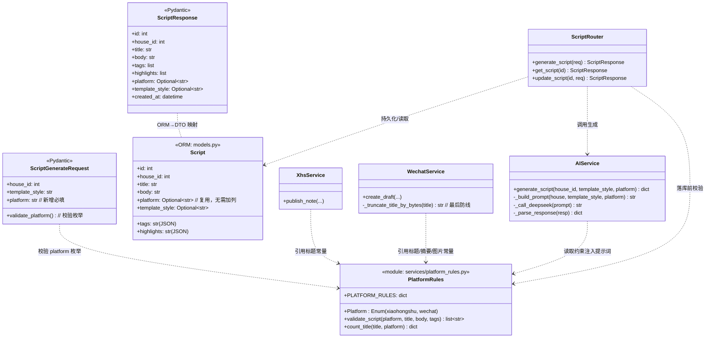
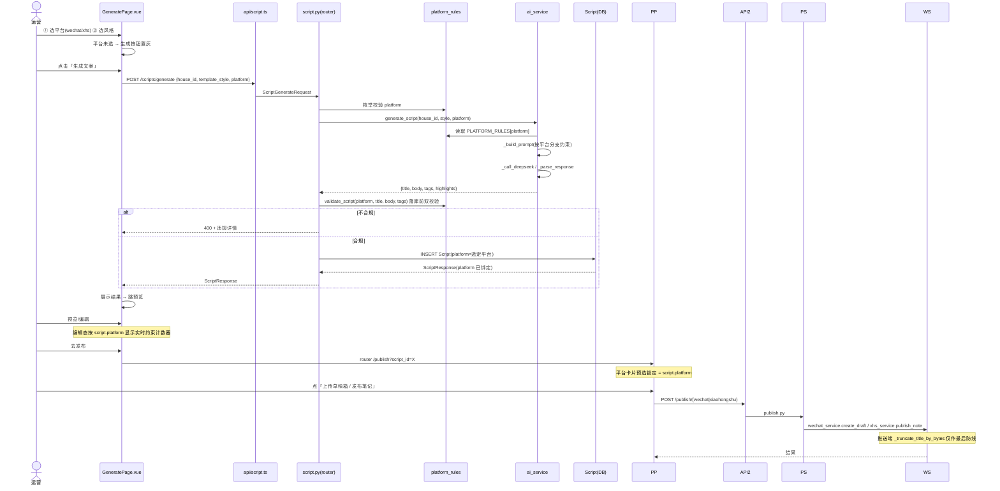
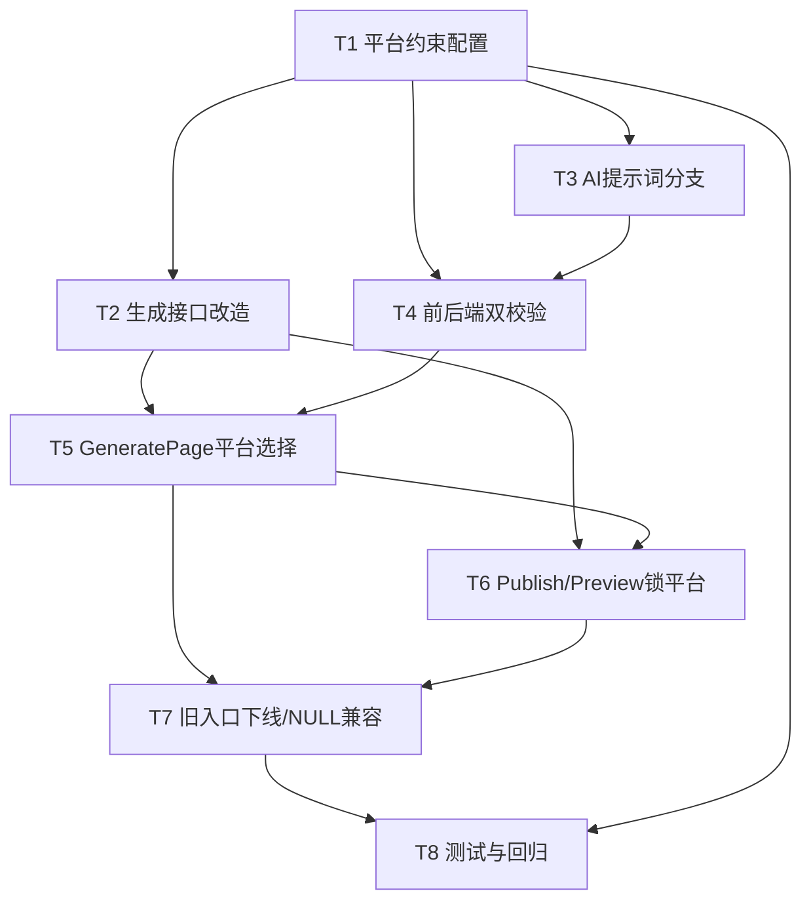

# 增量架构设计：house-ai 平台优先生成（Platform-First Generation）

> 文档定位：**增量架构设计 + 任务分解**。仅描述本次对现有 house-ai 的**变更部分**，基于**已 Read 核实的现有代码**（见附录「代码核实证据」），不凭空设计、不重写整体系统。
> 变更目标：把现有「先生成文案（平台=NULL）→ 再选平台推送」改为 **「先选平台（小红书/微信公众号）→ 按平台约束生成文案 → 预览/编辑 → 推送」唯一主流程**，从源头根治微信公众号 `45003` 标题超限、提升多平台分发质量。
> 技术基线：后端 **FastAPI + SQLAlchemy（异步）+ Pydantic v2**，子路径 `/house-ai/`；前端 **Vue 3 + TypeScript + Vite + Element Plus**，目录 `frontend-vue/`。

---

## 1. 实现方案 + 框架选型

### 1.1 核心难点

| 难点 | 说明 | 策略 |
|---|---|---|
| 平台约束「系统内置」且前后端口径一致 | 微信按**字节**(≤64)、小红书按**字符**(≤20)；前端计数器与后端校验必须同源 | 新增 `backend/services/platform_rules.py` 作为**唯一约束真源**；前端 `frontend-vue/src/utils/platformRules.ts` 镜像常量 + 计数工具 |
| 历史 `platform=NULL` 兼容性 | 旧文案无平台字段，直接推送会落入旧路径 | 发布页对 `NULL` 走兼容分支（提示重新生成 / 允许临时选平台），**不做 DB 回填迁移** |
| `Script.platform` 字段不可变 | 生成即绑定平台，切换平台=重生成新 Script | `generate_script` 写 platform；`update_script` **不**改 platform |
| 最小改动面 | 推送能力（`create_draft` / `publish_note`）本期不重写 | 仅注入合规输入，推送端 `_truncate_title_by_bytes` 保留为最后防线 |

### 1.2 框架选型

**不引入任何新框架/新依赖**。完全复用现有栈：

- 后端：FastAPI（路由）、Pydantic v2（Schema 校验）、SQLAlchemy（模型已含 `platform` 字段，无需加列）、`loguru`。
- 前端：Vue 3 `<script setup>` + Element Plus（卡片/输入框/计数器）+ TypeScript。实时字符/字节计数用原生 `String.length` 与 `TextEncoder`/正则即可，**无需引入校验库**。

### 1.3 架构模式

延续现有「路由层（routes）→ 服务层（services）→ 模型（models）」分层，**不加新层**，仅在服务层插入 `platform_rules` 配置模块作为横切约束源。

### 1.4 关键改动点一览

1. **前端生成页**：首步加「平台选择」卡片（微信/小红书），未选则「生成文案」按钮置灰；选中后动态展示该平台约束提示。
2. **后端生成接口**：`ScriptGenerateRequest` 新增 `platform` **必填**枚举（后端校验）；`generate_script` 按平台分支提示词，落库时写入 `Script.platform`。
3. **内置 `platform_rules`**：微信/小红书文本约束（标题字节/字符、摘要、正文、图片、话题、违禁词）配置化集中管理。
4. **发布页改直推**：`PublishPage` 平台卡片**预选锁定**为 `script.platform`，按钮文案随平台变化（微信→「上传草稿箱」/ 小红书→「发布笔记」），不再二次选平台。
5. **双校验**：前端实时计数器 + 后端 `generate_script` 落库前 `validate_script` 二次校验，推送端截断仅作最后防线。

---

## 2. 文件列表及相对路径

> 标记：【新】= 新增文件；【改】= 修改现有文件。

### 2.1 后端

| 文件 | 标记 | 改动说明 |
|---|---|---|
| `backend/services/platform_rules.py` | 【新】 | **平台约束唯一真源**：`PLATFORM_RULES` 字典、平台枚举、`validate_script()`、`count_title()` 计数工具；供生成/校验/推送各服务引用 |
| `backend/schemas.py` | 【改】 | `ScriptGenerateRequest` 新增 `platform: str`（必填）+ `field_validator` 校验枚举值 `xiaohongshu`/`wechat` |
| `backend/routes/script.py` | 【改】 | `generate_script`：接收 `platform` 并写入 `Script.platform`；落库前调用 `platform_rules.validate_script` 双校验；`update_script` 保持**不改** platform（不可变） |
| `backend/services/ai_service.py` | 【改】 | `generate_script(house_id, template_style, platform)` 新增 `platform` 参数；`_build_prompt` 按平台分支（微信图文/小红书种草），注入 `platform_rules` 约束 |
| `backend/services/wechat_service.py` | 【改】 | 常量 `WECHAT_TITLE_MAX_LEN` / `WECHAT_DIGEST_MAX_LEN` / `IMAGE_MAX_SIZE` **改从 `platform_rules` 导入**（保持 `_truncate_title_by_bytes` 不变，仅作为最后防线引用）；保留现有 `create_draft` 逻辑 |
| `backend/services/xhs_service.py` | 【改】 | `publish_note` 中 `title[:20]` 改引用 `platform_rules` 的 `XHS_TITLE_MAX_CHARS` 常量（消除魔法值）；可选：发布前轻量校验 |
| `backend/routes/publish.py` | 【改·可选】 | 发布前防御性校验 `script.platform` 与路由平台一致（不一致则 400）；不改动核心发布逻辑 |

### 2.2 前端

| 文件 | 标记 | 改动说明 |
|---|---|---|
| `frontend-vue/src/utils/platformRules.ts` | 【新】 | 前端镜像常量（标题上限、正文上限、话题数等）+ `countTitle()`/`countBody()` 计数工具（字节用 `TextEncoder`，字符用 `length`），与后端口径一致 |
| `frontend-vue/src/types/index.ts` | 【改】 | `ScriptGenerateRequest` 新增 `platform: Platform`；补充 `PlatformRules` 相关类型（可选）；`Platform` 枚举保持 `'xiaohongshu' \| 'wechat'` |
| `frontend-vue/src/pages/GeneratePage.vue` | 【改】 | 首步加「平台选择」卡片（必选）；未选平台时生成按钮置灰；选中后展示平台约束提示；编辑注入 `platformRules` 计数 |
| `frontend-vue/src/pages/PublishPage.vue` | 【改】 | 平台卡片**预选锁定**为 `script.platform`（默认不开放切换；历史 `NULL` 走兼容分支）；按钮文案随平台变化；微信保留账号选择 |
| `frontend-vue/src/pages/PreviewPage.vue` | 【改】 | 「选择平台发布」按钮改为「发布到{平台}」；编辑态标题/正文框加平台约束实时计数 |
| `frontend-vue/src/pages/HistoryPage.vue` | 【改·小】 | 文案项增加平台标签（复用已有 `platformLabel`）；历史 `platform=NULL` 文案进入发布页的兼容提示（配合 PublishPage） |
| `frontend-vue/src/api/script.ts` | 【改·小】 | `generateScript` 已透传请求体，仅确认 `platform` 字段随 `ScriptGenerateRequest` 类型一并传递（基本无需逻辑改动） |

---

## 3. 数据结构与接口

### 3.1 类图（后端约束源 + 数据/服务契约）

> 完整 Mermaid 另存于 `docs/class-diagram.mermaid`。



### 3.2 关键接口契约变更（JSON Schema 表示）

**① `ScriptGenerateRequest`（生成请求体，新增 `platform` 必填）**

```json
{
  "house_id": 12,
  "template_style": "professional",
  "platform": "xiaohongshu"   // 新增；枚举：xiaohongshu | wechat；缺失/非法 → 422/400
}
```

**② `Script.platform` 字段（ORM 复用，无需加列）**

```json
// models.Script.platform: Optional[str]  (String(50), nullable)
// 生成时写入选定平台；历史记录为 NULL；update 不改写（不可变原则）
{
  "platform": "wechat"   // 或 "xiaohongshu"；历史可能为 null
}
```

**③ `ScriptResponse`（响应，已含 `platform` 字段，原样返回）**

```json
{
  "id": 101,
  "house_id": 12,
  "title": "近地铁精装两居｜把日子过成诗🏠",
  "body": "...",
  "tags": ["近地铁", "精装修", "拎包入住"],
  "highlights": ["南北通透", "采光超好"],
  "platform": "xiaohongshu",
  "template_style": "professional",
  "created_at": "2026-07-09T10:00:00"
}
```

**④ `PLATFORM_RULES` 关键约束字段（设计稿，非代码）**

| 字段 | 微信(wechat) | 小红书(xiaohongshu) | 计量口径 |
|---|---|---|---|
| `title_max` | 64 | 20 | 微信=**UTF-8 字节**；小红书=**字符** |
| `digest_max` | 120 | —（无独立摘要） | 字符 |
| `body_max` | 无硬上限（建议≤800 软引导） | 1000（**待研发核实**） | 字符 |
| `image_min/max` | 1 / 无上限 | ≥1 / 18（**待核实**） | 张数 |
| `image_max_bytes` | 2MB | — | 字节 |
| `max_topics` | —（尾部 #标签 文本） | 10（**待核实**） | 个 |
| `forbidden_words` | []（可正常用「出租/租房」） | ["出租","租房","月租","租金","招租","房东"] | — |

> 表中标「待研发核实」项，在 `platform_rules` 中以 `unconfirmed=True` 标注，固化后再由产品/研发核对官方规则调整常量值（**无需改逻辑**）。

---

## 4. 程序调用流程

> 完整 Mermaid 另存于 `docs/sequence-diagram.mermaid`。

### 4.1 新主流程（选平台 → 按平台约束生成 → 预览/编辑 → 推送）



### 4.2 与旧流程的差异点

| 维度 | 旧流程 | 新流程 |
|---|---|---|
| 平台选择时机 | 生成后（PublishPage 才选） | 生成前（GeneratePage 首步必选） |
| `Script.platform` | 生成时 `NULL`，推送时才定 | 生成时即写入，文案与平台绑定 |
| 提示词 | 写死小红书风（`_build_prompt`） | 按平台分支（微信图文 / 小红书种草） |
| 合规保障 | 仅靠推送端 `title[:64]`/`[:20]` 截断兜底（曾触发 45003） | 生成端按平台约束 + 前后端双校验，推送端截断降为最后防线 |
| 发布页 | 自由选平台（可把微信文案推小红书） | 平台锁定为 `script.platform`，跨平台须重新生成 |
| 历史 `NULL` 文案 | 正常推送 | 进入兼容分支（提示重新生成 / 允许临时选平台） |

---

## 5. 任务列表（有序、含依赖、按实现顺序排列）

> 规则：每个任务标注 **依赖（Dependencies）** 与 **优先级（P0/P1）**；任务按实现顺序排列，前端任务依赖后端契约先行落地。

| 任务 | 名称 | 源文件（改/新） | 依赖 | 优先级 |
|---|---|---|---|---|
| **T1** | 后端平台约束配置 | `backend/services/platform_rules.py`【新】 | 无 | P0 |
| **T2** | 后端生成接口改造（platform 必填 + 落库） | `backend/schemas.py`【改】、`backend/routes/script.py`【改】 | T1 | P0 |
| **T3** | AI 提示词按平台分支 | `backend/services/ai_service.py`【改】 | T1 | P0 |
| **T4** | 前后端双校验 | `backend/services/platform_rules.py`(validate 接入)【改】、`backend/services/wechat_service.py`【改】、`backend/services/xhs_service.py`【改】、`frontend-vue/src/utils/platformRules.ts`【新】 | T1, T3 | P1 |
| **T5** | 前端 GeneratePage 加平台选择首步 | `frontend-vue/src/pages/GeneratePage.vue`【改】、`frontend-vue/src/types/index.ts`【改】 | T2, T4 | P0 |
| **T6** | 前端 PublishPage / PreviewPage 改直推 + 锁平台 | `frontend-vue/src/pages/PublishPage.vue`【改】、`frontend-vue/src/pages/PreviewPage.vue`【改】 | T2, T5 | P0/P1 |
| **T7** | 旧入口下线 / 历史 NULL 兼容 | `frontend-vue/src/pages/PublishPage.vue`【改】、`frontend-vue/src/pages/HistoryPage.vue`【改】、`backend/routes/publish.py`【改·可选】 | T5, T6 | P1 |
| **T8** | 测试与回归 | 后端单测 + 前后端联调主流程 + 历史 NULL 路径回归 | T1–T7 | P0/P1 |

### 5.1 任务依赖图（Mermaid）



### 5.2 各任务要点

- **T1**：定义 `PLATFORM_RULES`（微信/小红书全量约束）、`Platform` 枚举、`validate_script()`、`count_title()`；标 `unconfirmed` 待核实项。
- **T2**：`ScriptGenerateRequest.platform` 必填 + validator；`generate_script` 写 `Script.platform`；落库前调 `validate_script`；`update_script` 不改 platform。
- **T3**：`ai_service.generate_script` 加 `platform`；`_build_prompt` 分支（微信：图文结构、可含租赁词、标题≤64字节、摘要≤120字、封面提示；小红书：种草风、标题≤20字、正文≤1000字、`#话题#`、规避租赁直白词）。
- **T4**：后端 `validate_script` 接入生成落库；`wechat_service`/`xhs_service` 常量改从 `platform_rules` 引用；前端 `platformRules.ts` 镜像常量 + 计数工具，GeneratePage/PreviewPage 编辑框接实时计数器。
- **T5**：GeneratePage 首步平台卡片（必选）、未选置灰、选中展示约束提示；`types/index.ts` 的 `ScriptGenerateRequest` 加 `platform`。
- **T6**：PublishPage 平台卡片预选锁定 `script.platform`、按钮文案随平台变、微信保留账号选择；PreviewPage「选择平台发布」→「发布到{平台}」。
- **T7**：历史 `platform=NULL` 文案的发布兼容（提示重新生成 / 允许临时选平台）；HistoryPage 加平台标签；publish.py 可选防御校验。
- **T8**：`platform_rules` 校验单测、截断单测；主流程联调；历史 NULL 路径回归；回归现有微信/小红书发布能力不受影响。

---

## 6. 依赖包列表

**本期不引入任何新依赖（预期无）。**

| 包 | 是否新增 | 说明 |
|---|---|---|
| 后端（FastAPI / Pydantic / SQLAlchemy / loguru / httpx） | 否 | 全部已存在，仅改逻辑 |
| 前端（Vue3 / Element Plus / TypeScript / Vite） | 否 | 全部已存在 |
| 前端校验库（如 `zod` / `vee-validate`） | 否（**不引入**） | 实时计数用原生 `TextEncoder` + `String.length` 即可 |
| 前端 `platformRules.ts` | 【新·非依赖】 | 自研常量+工具模块，无第三方依赖 |

> 若后续要做 P2-2「平台规则可配置化后台」，可能引入配置存储，但本期不在范围内。

---

## 7. 共享知识（跨文件约定）

1. **平台枚举值统一**：后端/前端/数据库一律使用 `xiaohongshu` 与 `wechat` 两个字符串值（与现有 `models.Script.platform` 注释、前端 `Platform` 类型、发布路由路径保持一致）。**禁止**引入 `xhs` / `wechat_public` 等新别名，避免历史数据与新代码不一致。
2. **约束唯一真源**：所有平台文本约束集中在 `backend/services/platform_rules.py` 的 `PLATFORM_RULES`；`wechat_service` / `xhs_service` 的标题/摘要/图片常量**改从 `platform_rules` 导入**，不得各自硬编码，消除魔法值漂移。
3. **计量口径一致**：
   - 微信标题：**UTF-8 字节**（`len(s.encode('utf-8'))`），上限 64；emoji 占 3–4 字节须计入。
   - 小红书标题/正文/话题：**字符数**（`len(s)`），上限 20 / 1000（待核实）/ 10。
   - 前端计数器与后端 `count_title` / `validate_script` **使用同一套常量与算法**（前端 `platformRules.ts` 镜像）。
4. **生成即绑定、不可变**：`Script.platform` 在 `generate_script` 写入；`update_script` 不改写；切换平台 = 以新平台重新生成新 Script（见待明确 Q3）。
5. **双校验分层**：前端实时计数（体验/拦截）+ 后端落库前 `validate_script`（安全兜底）；推送端 `_truncate_title_by_bytes` 仅作**最后防线**，不再承担主合规职责。
6. **推送端契约不变**：`POST /api/v1/publish/wechat`、`POST /api/v1/publish/xiaohongshu`、`wechat_service.create_draft`、`xhs_service.publish_note` 接口与行为**本期不重写**，仅消费更合规的输入。
7. **响应格式统一**：沿用现有 `SuccessResponse` / `PublishResponse` / `ScriptResponse` 结构，不新增包装层。

---

## 8. 待明确事项（需产品/用户拍板的决策点）

> 以下提炼自 PRD「待确认问题 Q1–Q7」，给出**技术推荐**并标注「**需用户确认**」。建议主理人在转交工程师前先与产品/用户对齐。

| # | 决策点 | 技术推荐（高见远） | 需用户确认 |
|---|---|---|---|
| **Q1** | 小红书精确规则（正文 1000? 图片 18? 话题 10/20?） | 先以 PRD 默认值固化进 `PLATFORM_RULES`（正文≤1000字符、图片≥1、话题≤10每≤20），标 `unconfirmed=True`；后续核对官方只需改常量，**不改逻辑** | ✅ 确认默认值；或提供官方最新数值 |
| **Q2** | 历史 `platform=NULL` 文案兼容 | **方案 A**：查看可保留；进入发布页若 `platform=NULL`，退回「请选择平台」并提示「建议按目标平台重新生成以获得最佳合规」，但**允许其临时选平台直推**；**不做 DB 回填迁移**（避免误标） | ✅ 接受方案 A，还是强制「必须重新生成」（禁止 NULL 直推）？ |
| **Q3** | 生成中切换平台 | 采纳 PRD 推荐：**切换平台 = 以新平台重新生成一条新 Script**（不可变），不在原地改 `platform` | ✅ 确认采纳（低风险） |
| **Q4** | 微信正文篇幅 | 生成阶段给「建议≤800字」**软引导**（注入提示词，不硬校验拦截）；硬校验仅管标题字节/摘要字符 | ✅ 是否要该软引导值；或完全不限 |
| **Q5** | 流程合并粒度 | **保留** `/generate`、`/preview/:id`、`/publish` 三步路由，仅改交互（首步加平台选择、发布页锁平台）；不合并单页，降低改动面与回归风险 | ✅ 确认保留路由；或要求合并为单页 |
| **Q6** | 是否彻底移除「通用/无平台」生成入口 | **是**：废弃无平台生成（后端 `platform` 必填拦截，前端无平台不能生成）；历史 NULL 文案按 Q2 处理 | ✅ 确认连「暂不定平台」草稿模式也一并移除（推荐移除） |
| **Q7** | 微信多账号选择时机 | **维持推送前**（PublishPage）选择，沿用现有多账号能力，不前移 | ✅ 确认维持（低风险） |

**强烈建议优先对齐**：Q2（历史兼容策略）、Q6（是否彻底移除无平台入口）——二者直接决定 T7 的实现形态与是否保留旧分支代码。

---

## 附录：代码核实证据（本次 Read 确认，未改动）

| 关注点 | 代码位置 | 关键事实（核实） |
|---|---|---|
| 生成请求体 | `backend/schemas.py` `ScriptGenerateRequest` | 仅 `house_id` + `template_style`，**无 platform** |
| 生成路由 | `backend/routes/script.py` `generate_script` | 调 `ai_service.generate_script(house_id, template_style)`，`Script(...)` 未设 `platform`（保持 NULL） |
| AI 提示词 | `backend/services/ai_service.py` `_build_prompt` | 写死「小红书好物分享博主」，标题「20字以内」、禁租赁词；**未区分平台** |
| 微信标题约束 | `backend/services/wechat_service.py` `WECHAT_TITLE_MAX_LEN=64` + `_truncate_title_by_bytes` | 按**字节**限制 64；旧兜底 `title[:64]` 按字符截 → 192 字节超限制 → `45003` |
| 微信摘要约束 | `wechat_service.py` `WECHAT_DIGEST_MAX_LEN=120` + `_build_digest` | 摘要 ≤120 字符，由 body 自动截取 |
| 微信图片约束 | `wechat_service.py` `IMAGE_MAX_SIZE=2MB` | 封面必填，单图 ≤2MB |
| 小红书标题约束 | `backend/services/xhs_service.py` `publish_note` `title[:20]` | 标题 ≤20 字符（「最多20个中文字」） |
| 小红书正文约束 | `xhs_service.py` | 代码**未限制**正文长度 |
| Script 模型 | `backend/models.py` `Script` | 已有 `platform`（String(50), nullable）、`template_style` → **可复用，无需加列** |
| 前端生成页 | `frontend-vue/src/pages/GeneratePage.vue` | 仅有房源信息/风格选择/生成/结果，**无平台选择**；调 `POST /scripts/generate` |
| 前端推送页 | `frontend-vue/src/pages/PublishPage.vue` | 有「平台选择卡片（小红书/微信）」+ 微信账号选择 + 发布；`selectedPlatform` 默认 `xiaohongshu` |
| 前端预览页 | `frontend-vue/src/pages/PreviewPage.vue` | 「选择平台发布」按钮跳 `/publish?script_id=` |
| 类型定义 | `frontend-vue/src/types/index.ts` | `Platform = 'xiaohongshu' \| 'wechat'`；`Script.platform?` 已存在；`ScriptGenerateRequest` 无 platform |
| 路由前缀 | `backend/main.py` | `script.router` / `publish.router` 均以 `/api/v1` 为前缀；前端子路径 `/house-ai/` |
