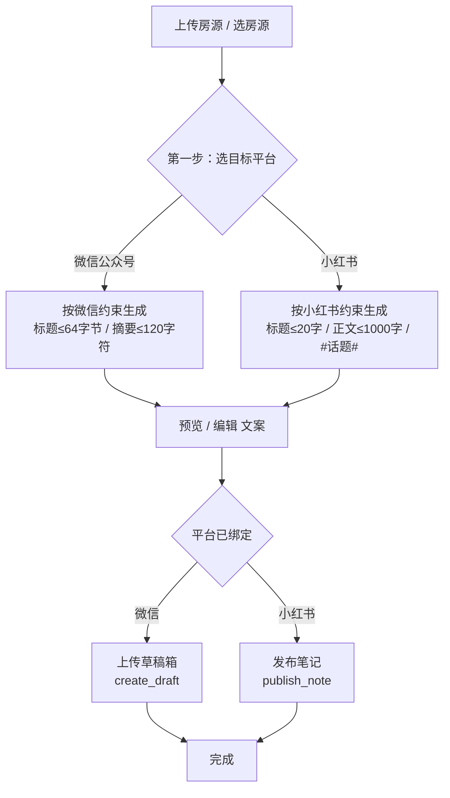

# 增量 PRD：house-ai 平台优先生成（Platform-First Generation）

> 文档定位：**增量需求**，仅描述本次对现有 house-ai 的**变更部分**。不重写整体系统 PRD（整体 PRD 见 `PRD.md`）。
> 变更范围：把现有「先生成文案 → 再选平台推送」改为「先选平台 → 按平台约束生成文案 → 预览/编辑 → 推送」作为**唯一主流程**，从源头根治标题超限、提升多平台分发质量。
> 调研依据：仅基于只读阅读的现有代码（见附录「代码调研证据」）。**未改动任何业务代码**。

---

## 1. 产品目标（Why）

将「生成」与「目标平台」解耦的现状收敛为**平台优先**的单一主流程：在 AI 生成阶段即按所选平台（微信公众号 / 小红书）的文本规则（标题字节/字数、摘要长度、话题标签、违禁词策略）约束输出，使生成的 `Script` 天然合规，**从源头消除微信公众号 `45003 title size out of limit` 等超限错误**，并提升小红书种草文案的适配度；推送端现有的字节截断兜底仅作为最后一道防线保留，不再承担主要合规职责。

---

## 2. 用户故事（User Stories）

主线：**先选平台 → 按平台约束生成文案 → 预览/编辑 → 推送**

- **US-1（微信分支）**：作为一名运营，我希望在生成文案前先选择「微信公众号」，系统按微信规则（标题 ≤64 字节≈21 中文字、摘要 ≤120 字符、封面必填 ≤2MB）生成图文草稿文案，以便一键上传草稿箱时**不再触发 45003 超限错误**。

- **US-2（小红书分支）**：作为一名运营，我希望先选择「小红书」，系统按小红书规则（标题 ≤20 字、正文 ≤1000 字、种草风、含 `#话题#`、规避直白租赁词）生成笔记文案，以便发布时格式与长度天然合规、更易获推荐。

- **US-3（实时约束提示）**：作为一名运营，我希望在生成页/编辑页看到所选平台的**实时约束提示**（如微信标题框显示「剩余 X/21 字（字节 Y/64）」，小红书显示「剩余 X/20 字」），以便我在 AI 生成前后都能感知并满足平台限制。

- **US-4（平台绑定后直推）**：作为一名运营，我希望生成后的文案已绑定平台，进入预览/编辑页后**直接推送该平台**（无需再次选择平台），使「生成 → 推送」成为一条顺畅闭环，旧「先生成后选平台」的割裂入口不再存在。

---

## 3. 需求池（Requirements Pool）

优先级：**P0 = 必须（Must）｜ P1 = 应当（Should）｜ P2 = 可选（Nice to have）**

### P0（必须）

- **P0-1 生成前必须先选平台**：`ScriptGenerateRequest` 新增 `platform` 必填项（`xiaohongshu` / `wechat`）。未选平台时禁止生成，前端生成页第一步强制平台选择，无平台入口不可发起生成。
- **P0-2 按所选平台约束生成文案**：AI 提示词按平台分支，从源头遵守：
  - 微信：标题 ≤64 字节（纯中文≈21 字，含 emoji 计入字节）、摘要 ≤120 字符、可正常出现「出租/租房」等合规词、适配图文结构；
  - 小红书：标题 ≤20 字符、正文 ≤1000 字符（待研发核实）、种草风、含 `#话题#`、规避直白租赁词。
- **P0-3 平台约束系统内置**：各平台文本规则由研发调研后以**常量/配置化**方式写死在后端（如新增 `backend/services/platform_rules.py` 或 `config.py`），生成服务按平台读取并注入提示词；**不依赖推送端截断兜底作为主要合规手段**。
- **P0-4 生成即写入平台字段**：复用现有 `Script.platform` 字段（模型已存在，目前生成时为 `NULL`），生成时写入所选平台，使文案与平台绑定。
- **P0-5 推送能力沿用现有实现**：微信公众号 `wechat_service.create_draft()`、小红书 `xhs_service.publish_note()` 的推送/草稿逻辑**本期不重写**，仅在生成侧保证输入合规；推送端的 `_truncate_title_by_bytes` 等兜底**保留为最后防线**。
- **P0-6 旧「先生成后选平台」入口下线**：`GeneratePage.vue` 不得再提供「无平台生成」；`PublishPage.vue` 不再作为独立「先选平台」入口，改为对已绑定平台 `Script` 的直推页（平台默认取自 `script.platform`）。
- **P0-7 生成页交互首步为平台选择**：生成页 UI 第一步为平台 radio/卡片（微信 / 小红书），选中后即时展示该平台的约束提示与差异化的生成引导。

### P1（应当）

- **P1-1 预览/编辑页按平台适配**：`PreviewPage.vue` 依据 `script.platform` 展示对应平台约束提示与「推送」按钮，锁定平台（不再二次选平台），按钮文案随平台变化（微信→「上传草稿箱」/ 小红书→「发布笔记」）。
- **P1-2 前后端双重约束校验**：前端提供实时字数/字节计数器；后端在 `generate_script` 落库前对标题/正文做平台规则二次校验（生成侧兜底），与推送侧兜底形成双保险。
- **P1-3 生成中切换平台处理**：在生成页已选平台后中途切换，视为「以新平台重新生成一条新 `Script`」（遵循不可变原则），不原地改写已有 `Script.platform`。
- **P1-4 历史 `Script` 兼容**：对存量 `platform=NULL` 的历史文案给出明确处理（查看可保留；重新推送时按默认平台兜底或提示「请按目标平台重新生成」）。具体方案见「待确认问题 Q2」。

### P2（可选）

- **P2-1 多平台一次成稿**：同一房源可一次性按各平台约束各生成一份（如微信版 + 小红书版），便于跨平台分发。
- **P2-2 平台规则可配置化**：平台约束（字数/字节/摘要/话题数等）通过配置文件或管理后台调整，无需改代码。
- **P2-3 平台适配度自检**：生成后给出一份「平台适配度检查」报告（标题/正文/摘要是否达标、话题数是否合规）。

---

## 4. 平台文本约束表（Platform Text Constraints）

下表汇总微信 / 小红书在生成阶段必须遵守的文本约束。**已知值取自代码常量/注释；未知项基于公开常识给合理默认值并标注「待研发核实」。**

| 维度 | 微信公众号（wechat） | 小红书（xiaohongshu） | 来源 / 证据 |
|---|---|---|---|
| **标题长度** | ≤ **64 字节**（UTF-8；纯中文≈21 字；emoji 占 3–4 字节，需计入） | ≤ **20 字符**（汉字/字母/数字/标点各算 1，emoji 通常算 1–2） | 微信：`wechat_service.WECHAT_TITLE_MAX_LEN = 64`（代码常量）；小红书：`xhs_service.publish_note` 中 `title = title[:20]` + docstring「最多20个中文字」（代码常量） |
| **正文长度** | 无硬性字数上限（图文正文为 HTML）；生成阶段按平台风格引导篇幅 | ≤ **1000 字符**（公开常识，建议值） | 微信：代码无限制；小红书：代码未限制 → **待研发核实** |
| **摘要 digest** | ≤ **120 字符**（`WECHAT_DIGEST_MAX_LEN=120`，代码常量；由 body 自动截取首句） | 无独立摘要字段（首行作为外部预览） | 微信：代码常量；小红书：平台机制 |
| **封面 / 图片** | 必填 **1 张封面**，单图 ≤ **2MB**（`IMAGE_MAX_SIZE=2MB`，代码常量） | 必填 **≥1 张**；单篇最多 **18 张**（公开常识） | 微信：代码常量；小红书：单篇上限 **待研发核实** |
| **格式 / 话题标签** | 无 `#话题#` 概念；标签以 `#xxx` 文本嵌入正文尾部（见 `_build_html_content`） | 支持 `#话题#`，建议 ≤ **10 个**、每个 ≤20 字（公开常识） | 微信：代码实现；小红书：话题数/长度 **待研发核实** |
| **违禁 / 敏感词策略** | 公众号可正常出现「出租 / 租房 / 月租 / 租金」等合规词（官方号） | 严禁「出租 / 租房 / 月租 / 租金 / 招租 / 房东」等直白租赁词（现有 AI 提示词规避限流） | 微信：业务判断；小红书：`ai_service._build_prompt` 现有约束 |
| **emoji 策略** | 标题可含少量 emoji，但占用字节，须计入 64 字节 | 鼓励适当 emoji（种草风） | 生成引导 |

> 说明：微信的 `45003` 报错根因是**标题按字节超限**（原推送端按字符 `title[:64]` 截断会得到 64 个中文字=192 字节，远超 64）。新流程要求 AI 在生成阶段即以「≤64 字节（含 emoji）」为目标，并在前端以字节维度实时提示，从根本上规避。

---

## 5. UI 设计稿（关键页面交互变更）

### 5.1 新主流程（Mermaid 流程图）



### 5.2 生成页（GeneratePage）交互变更（ASCII 草图）

```
┌─────────────────────────────────────────────┐
│ 房源信息（复用现有卡片）                       │
│   近地铁精装两居 · 2室1厅 · 89㎡ · ¥6500/月   │
├─────────────────────────────────────────────┤
│ ① 选择目标平台  ★新增首步，必选              │
│   ┌──────────────┐   ┌──────────────┐        │
│   │ ◉ 小红书     │   │ ○ 微信公众号 │        │  ← radio/卡片，未选不可生成
│   │ 发布到小红书 |   │ 创建微信草稿 |        │
│   └──────────────┘   └──────────────┘        │
├─────────────────────────────────────────────┤
│ 平台约束提示（随平台动态变化）                 │
│   [小红书选中] 标题≤20字 · 正文≤1000字        │
│               · 带#话题# · 规避租赁直白词      │
│   [微信选中]  标题≤64字节≈21中文字 · 摘要≤120 │
│                · 封面必填≤2MB                  │
├─────────────────────────────────────────────┤
│ ② 选择文案风格（复用现有）                     │
│   [种草推荐] [生活日记] [心动安利]            │
├─────────────────────────────────────────────┤
│ [ 生成文案（按钮，未选平台置灰） ]             │
├─────────────────────────────────────────────┤
│ 生成结果 → 跳预览/编辑                         │
└─────────────────────────────────────────────┘
```

### 5.3 标题实时约束计数器（编辑/生成场景）

- 选 **微信**：标题输入框下方显示 `剩余 X/21 字（字节 Y/64）`，emoji 按 3–4 字节扣除；超出时标红并禁用「保存/生成」。
- 选 **小红书**：标题输入框下方显示 `剩余 X/20 字`；正文区显示 `字数 Y/1000`；话题标签区显示 `话题 N/10`。
- 计数器逻辑须与后端 `platform_rules` 一致（前端展示 + 后端落库前校验双保险）。

### 5.4 推送页（PublishPage）变更

旧：`平台选择卡片（小红书/微信）` + 账号选择 → 发布。
新：`平台选择卡片` 默认 **预选并锁定** 为 `script.platform`（来自生成时写入的字段），展示「正在推送到：微信公众号 / 小红书」；微信仍保留账号选择（沿用 `WechatAccount` 多账号）；不再允许用户把一条已绑定微信的文案改推小红书（跨平台须重新生成）。

---

## 6. 待确认问题（Open Questions）

1. **小红书精确规则（Q1）**：正文上限究竟是 1000 字符还是其他值？单篇图片上限是否为 18 张？话题标签上限是否为 10 个 / 每个 ≤20 字？— 表中相关项已标「待研发核实」，需研发/产品核对官方最新规则后固化进 `platform_rules`。
2. **历史 `Script` 兼容性（Q2）**：存量 `platform=NULL` 文案如何处理？方案 A：仅可查看，重新推送时提示「请按目标平台重新生成」；方案 B：按「默认平台」兜底推送。是否需要对历史数据做 `platform` 回填迁移？
3. **生成中切换平台（Q3）**：在生成页已选平台后中途切换，采用「重新生成一条新 `Script`」还是「原地改 `platform` 重生成」？本 PRD 推荐前者（不可变原则），请确认。
4. **微信正文篇幅（Q4）**：微信图文正文无硬性字数上限，是否需要在生成阶段给一个「建议上限」（如 ≤800 字）以优化阅读？还是完全不限、仅由风格引导？
5. **流程合并粒度（Q5）**：是否将「生成 → 预览编辑 → 推送」合并为单一页面流程，还是保留 `/generate`、`/preview/:id`、`/publish` 三步路由但改变交互（推荐保留路由、改交互，降低改动面）？
6. **是否彻底移除「通用/无平台」生成（Q6）**：需求明确「废弃旧模式」，确认是否连「先写文案日后再定平台」的通用模式也一并移除入口？
7. **微信多账号选择时机（Q7）**：在「平台优先」流程下，公众号账号（`WechatAccount`）的选择维持在推送前（`PublishPage`）还是前移到生成页？本 PRD 建议维持推送前选择，沿用现有多账号能力。

---

## 附录：代码调研证据（只读，未改动）

| 关注点 | 代码位置 | 关键事实 |
|---|---|---|
| 生成请求体 | `backend/routes/script.py` `ScriptGenerateRequest`（`backend/schemas.py`） | 仅 `house_id` + `template_style`，**无 platform**；生成时 `Script.platform` 未赋值（保持 `NULL`） |
| AI 提示词（现仅小红书风） | `backend/services/ai_service.py` `_build_prompt` | 写死「小红书好物分享博主」，标题「20字以内」，正文 300–500 字，禁租赁词；**未区分平台** |
| 微信标题约束 | `backend/services/wechat_service.py` `WECHAT_TITLE_MAX_LEN=64`、`_truncate_title_by_bytes` | 标题按**字节**限制 64；旧兜底 `title[:64]` 按字符截导致 192 字节超限制 → `45003` |
| 微信摘要约束 | `backend/services/wechat_service.py` `WECHAT_DIGEST_MAX_LEN=120`、`_build_digest` | 摘要 ≤120 字符，由 body 自动截取 |
| 微信图片约束 | `backend/services/wechat_service.py` `IMAGE_MAX_SIZE=2MB` | 封面必填，单图 ≤2MB |
| 小红书标题约束 | `backend/services/xhs_service.py` `publish_note` `title[:20]` + docstring | 标题 ≤20 字符（「最多20个中文字」） |
| 小红书正文约束 | `backend/services/xhs_service.py` | 代码未限制正文长度 |
| Script 模型 | `backend/models.py` `Script` | 已有 `platform`（String(50), nullable）、`template_style` 字段 → **可复用，无需迁移加列** |
| 前端生成页 | `frontend-vue/src/pages/GeneratePage.vue` | 仅有「房源信息 / 风格选择 / 生成 / 结果」，**无平台选择**；调 `POST /api/v1/scripts/generate` |
| 前端推送页 | `frontend-vue/src/pages/PublishPage.vue` | 有「平台选择卡片（小红书/微信）」+ 微信账号选择 + 发布；调 `POST /api/v1/publish/{platform}` |
| 前端预览/编辑页 | `frontend-vue/src/pages/PreviewPage.vue` | 预览/编辑 `Script`，「选择平台发布」跳 `/publish?script_id=` |
| 路由 | `frontend-vue/src/router/index.ts` | `/generate`、`/preview/:id`、`/publish`、`/history` 等；子路径部署 `/house-ai/` |
| 后端路由前缀 | `backend/main.py` | `script.router`、`publish.router` 均以 `/api/v1` 为前缀 |
| 类型定义 | `frontend-vue/src/types/index.ts` | `Platform = 'xiaohongshu' | 'wechat'`；`Script.platform?` 已存在 |
